•<br><br>
<H1 align="center">
𝘾𝒐𝙢𝒑𝙪𝒕𝙚𝒓 𝒔𝙘𝒊𝙚𝒏𝙘𝒆 𝒊𝙨 𝙣𝒐 𝒎𝙤𝒓𝙚 𝙖𝒃𝙤𝒖𝙩 𝙘𝒐𝙢𝒑𝙪𝒕𝙚𝒓𝙨 𝙩𝒉𝙖𝒏 𝒂𝙨𝒕𝙧𝒐𝙣𝒐𝙢𝒚 𝒊𝙨 𝙖𝒃𝙤𝒖𝙩 𝙩𝒆𝙡𝒆𝙨𝒄𝙤𝒑𝙚𝒔!<br/>
 
</H1><h4 align="center">𝗘.𝗪. 𝗗𝗶𝗷𝗸𝘀𝘁𝗿𝗮 (𝟭𝟵𝟯𝟬–𝟮𝟬𝟬𝟮); 𝗧𝘂𝗿𝗶𝗻𝗴 𝗔𝘄𝗮𝗿𝗱 𝟭𝟵𝟳𝟮.</h4>
 


<h2 align="left">

| 🔥 GISTs/Projects | 🚀 URLs |
|-----------|----------|
| 🔎 **WhoIS T35T** | [](https://michele-tn.github.io/T35T_Wh0IS/) |
| ⚡ **DNS Speed Test Script** | [](https://gist.github.com/michele-tn/cb3ea408de612b897c2a5f6ede256a51) |
| 🧩 **DNS Configuration for IONOS VPS (Ubuntu Server)** | [](https://gist.github.com/michele-tn/cb3ea408de612b897c2a5f6ede256a51?permalink_comment_id=5932892#gistcomment-5932892) |
| 📦 **Setup DNS IONOS Script** | [](https://gist.github.com/michele-tn/3a6eac5b927486d8cb9405f2ce66a370) |


</h2><br/>

### 🔥 Useful Gists & Repository!
<div style="display: flex; flex-direction: column; gap: 40px; align-items: flex-start; justify-content: center;">

<!-- <a href="https://gist.github.com/michele-tn/6185f852f80297dec232b67ecad85c3e" target="_blank">
  
</a> -->
<a href="https://gist.github.com/michele-tn/59ea8f7db8fa810ca3c6c552fab225e7" target="_blank">
  
</a><br/>  
<br/>
= — — — — — — — — — — — — — — — — — — — — — =<br/>
<table style="width:100%;">
  
  <tr>
    <td colspan="2" align="center" width="100%">
      <a href="https://gist.github.com/michele-tn/6185f852f80297dec232b67ecad85c3e" target="_blank">
        
      </a> 
    </td>
  </tr>

  <tr>
    <td align="center" width="50%">
      <a href="https://github.com/michele-tn/SSH-Tunnel-Service-Reverse-SSH-Port-Forwarding-Windows-">
        
      </a>
    </td>
    <td align="center" width="50%">
      <a href="https://github.com/michele-tn/SSH-appSettings-Configurator">
        
      </a>
    </td>
  </tr>

  <tr>
    <td colspan="2" align="center" width="100%">
      <a href="https://github.com/michele-tn/Secure-E-mail-Notifications-for-Fail2Ban-using-Gmail-SMTP-or-Gmail-API/blob/main/README.MD" 
         target="_blank" 
         style="text-decoration: none;">
        
      </a>
    </td>
  </tr>

  <!-- ✅ Sentinel Report Project -->
  <tr>
    <td colspan="2" align="center" width="100%">
      <a href="https://github.com/michele-tn/Sentinel-Report?tab=readme-ov-file" 
         target="_blank" 
         style="text-decoration: none;">
        
      </a>
    </td>
  </tr>

</table>
= — — — — — — — — — — — — — — — — — — — — — =<br/>

<br/>
      <a href="https://gist.github.com/michele-tn/1334d8796d2c4e308f9da69d34db49b6">
        
      </a><br/>

<a href="https://github.com/michele-tn/Show-Localhost-Tunnels" target="_blank" style="text-decoration: none;">
  
</a>
<br/>
<!-- 🧩 GIST: RustDesk Portable Auto Downloader -->
<a href="https://gist.github.com/michele-tn/3dd7b8c2f4c6a4e3c21fd4b5c7d40a6d" target="_blank">
  
</a><br/><br/>
• • • • • • • • • • • • • • • • • • • • • • • • • •<br/>


  <a href="https://gist.github.com/michele-tn/b9123d60660a2b2b780b24de65a935f5" target="_blank">
    
  </a><br/>

  <a href="https://gist.github.com/michele-tn/a591525fb4d4171e328cdcc49e2ac051" target="_blank">
    
  </a><br/>

  <a href="https://gist.github.com/michele-tn/72e98318c1994baec01c6247510ccdb9" target="_blank">
    
  </a><br/>

  <a href="https://gist.github.com/michele-tn/6d1d43b7111a2e04947ebad76e077f2c" target="_blank">
    
  </a><br/>

  <a href="https://gist.github.com/michele-tn/96e7743ca0740e3a2a077a30985c90e8" target="_blank">
    
  </a><br/>
<a href="https://github.com/michele-tn/SystemMetricsPanel" target="_blank">
  
</a><br/>

• • • • • • • • • • • • • • • • • • • • • • • • • •
  <br/><br/><a href="https://gist.github.com/michele-tn/f2c5bfbc4e6c6470ea3a16673dcb5038" target="_blank">
    
  </a>
  <a href="https://michele-tn.github.io/online-tools/" target="_blank">
    
  </a>


<h3>**Chrome extension:</h3>
<!-- Inserito: m3u8 Catcher Pro v4.6 -->
<a href="https://github.com/michele-tn/m3u8-Catcher-Pro-v4.6-Chrome-extension" target="_blank" style="text-decoration: none; margin-top: 10px;">
  </a><br/><br/>
</div>


---
---


### 🔥 MVVM (Model-View-ViewModel) design pattern !!!!
<!--The MVVM (Model-View-ViewModel) design pattern is a software architectural pattern commonly used in building user interfaces, especially in desktop and mobile applications. It helps separate the development of the graphical user interface (UI) from the business logic or backend logic.-->
The MVVM (Model-View-ViewModel) design pattern enforces a clear separation of concerns by decoupling the user interface (View) from the underlying business logic and data (Model), with the ViewModel acting as a mediator. This structure enhances code clarity, testability, and long-term maintainability.


```sql
+-------------+       +----------------+       +--------+
|   View      | <---> |  ViewModel     | <---> | Model  |
+-------------+       +----------------+       +--------+
```
#### 1. Model
- Represents the data and business logic.
- Responsible for retrieving, storing, and managing application data (e.g., via APIs, databases).
Not aware of the View or ViewModel.
#### 2. View
- The UI layer that the user interacts with.
- Displays data from the ViewModel.
- Uses data binding to reflect updates from the ViewModel automatically.
- Has no direct logic for handling business rules.
#### 3. ViewModel
- Acts as a bridge between the View and the Model.
- Holds presentation logic, and commands (e.g., button click logic).
- Exposes data and commands to the View, usually via observables (e.g., INotifyPropertyChanged in C#, LiveData in Android).
- Communicates with the Model to fetch/update data.

#### 🔄 Key Features of MVVM
- Two-way data binding (View <-> ViewModel)
- Loose coupling between UI and business logic
- Testability: ViewModel and Model can be tested independently of the UI
- Code reuse and maintainability

<table>
  <tr>
    <td>
      <a href="https://giobel.github.io/MVVM/">
        
      </a>
    </td>
    <td>
      <a href="https://github.com/codingfreak/blogsamples/tree/master/MvvmSample">
        
      </a>
      <br><br>
      <a href="https://github.com/Savelenko/functional-mvvm">
        
      </a>
      <br><br>
      <a href="https://www.youtube.com/playlist?list=PL0qAPtx8YtJe3WjjoRaB28ZGlX9heBqn3">
        
      </a>
      <br><br>
      <a href="https://www.google.com/search?q=intext%3ADesign+Patterns%3A+Elements+of+Reusable+Object-Oriented+Software+%2Bfiletype%3Apdf">
        
      </a>
    </td>
</table>
<table>
  <tr>
    <td>
  <a href="https://github.com/zetanove/design-pattern">
    
  </a>
</td>
  </tr>
</table>

---
---

### 🔥 Useful RegEX How-Tos !!!!
<table>
  <tr>
    <td>
      <a href="https://github.com/ziishaned/learn-regex">
        
      </a>
    </td>
    <td>
      <a href="https://www3.ntu.edu.sg/home/ehchua/programming/howto/Regexe.html">
        
      </a>
      <br><br>
      <a href="https://www.regular-expressions.info/refflavors.html">
        
      </a>
    </td>
  </tr>
</table>


| **Resource**                                           | **Link**                                                                                                                                                                                                                                                                                           |
|--------------------------------------------------------|----------------------------------------------------------------------------------------------------------------------------------------------------------------------------------------------------------------------------------------------------------------------------------------------------|
| *Mastering Regular Expressions* – O'Reilly (PDF)       | [Download PDF](https://www.google.com/search?q=inurl%3A%22OReilly.Mastering.Regular.Expressions.3rd.Edition%22&sca_esv=1bbf12dcdfda0a2c&ei=WLMkaPPxHdP_7_UPu-rw4A8&ved=0ahUKEwjz_eOMoKONAxXT_7sIHTs1HPwQ4dUDCBA&uact=5&oq=inurl%3A%22OReilly.Mastering.Regular.Expressions.3rd.Edition%22&gs_lp=Egxnd3Mtd2l6LXNlcnAiOWludXJsOiJPUmVpbGx5Lk1hc3RlcmluZy5SZWd1bGFyLkV4cHJlc3Npb25zLjNyZC5FZGl0aW9uIkixJlC9E1jQHXABeACQAQCYAUOgAZoJqgECMjO4AQPIAQD4AQGYAgCgAgCYAwCIBgGSBwCgB4sIsgcAuAcA&sclient=gws-wiz-serp) |
| Advanced RegEx Guide – RexEgg                          | [Visit Website](https://www.rexegg.com/)                                                                                                                                                                                                                                                           |
| *Regular Expressions Cookbook* (Official site)         | [Visit Website](https://www.regular-expressions-cookbook.com/)                                                                                                                                                                                                                                     |
| RegEx Comparison Across Languages (PDF)                | [Download PDF](https://www.google.com/search?q=%22RegExp_perl_python_java_etc%22+filetype%3Apdf&oq=%22RegExp_perl_python_java_etc%22+filetype%3Apdf&gs_lcrp=EgZjaHJvbWUyBggAEEUYOdIBBzczN2owajmoAgCwAgE&sourceid=chrome&ie=UTF-8)                                                                  |
| RegexBuddy Tool                                        | [Visit Website](https://www.regexbuddy.com/)                                                                                                                                                                                                                                                       |
| The Regex Coach Tool                                   | [Visit Website](https://weitz.de/regex-coach/)                                                                                                                                                                                                                                                     |


---
---

### 🔥 Backup and Restore GRUB Configuration to Prevent Boot Issues
<a href="https://gist.github.com/michele-tn/306de7684deac6aa2dd5719707cc0041" target="_blank">
  
</a>

### 🔥 Windows 11 - Restore Classic Context Menu
<a href="https://gist.github.com/michele-tn/c7d37a8cd1429cf8cb7cb44e8f9f0521" target="_blank">
  
</a>

### 🔥 Set Up a #ZeroTier Network on #OpenWRT Router
<a href="https://gist.github.com/michele-tn/423d1ac079afcf20b6bec32043d25414" target="_blank">
  
</a>

<!--
- **𝑺𝑺𝑯 𝑻𝒖𝒏𝒏𝒆𝒍𝒔 𝑨𝑺𝑪𝑰𝑰 𝒅𝒊𝒂𝒈𝒓𝒂𝒎𝒔** <br>
🔗 [gist.github link](https://gist.github.com/michele-tn/59ea8f7db8fa810ca3c6c552fab225e7)<br>
- **[SSH!] 𝑾𝙞𝒓𝙚𝒔𝙝𝒂𝙧𝒌 𝑻𝙘𝒑𝙙𝒖𝙢𝒑 𝑹𝙚𝒎𝙤𝒕𝙚 𝘾𝒂𝙥𝒕𝙪𝒓𝙞𝒏𝙜!** <br>
🔗 [gist.github link](https://gist.github.com/michele-tn/a591525fb4d4171e328cdcc49e2ac051) -->

---
---

## 🕵️‍♂️ Reverse Engineering Toolkit

A curated list of reverse engineering tools, courses, and resources 🧠🔍

| 🔗 Resource | 📄 Description |
|------------|----------------|
| [](https://0xinfection.github.io/reversing/) | 🌐 Personal blog with reversing content |
| [](https://github.com/horsicq/pex64dbg) | 🛠️ PE explorer/debugger |
| [](https://github.com/x64dbg/x64dbg) | 🔧 Advanced open-source debugger |
| [](https://github.com/wtsxDev/reverse-engineering) | 📚 General RE resources |
| [](https://github.com/mytechnotalent/Reverse-Engineering) | 🧑‍🏫 RE for absolute beginners |
| [](https://github.com/0xZ0F/Z0FCourse_ReverseEngineering?tab=readme-ov-file) | 🎓 Free RE course by 0xZ0F |
| [](https://github.com/NationalSecurityAgency/ghidra) | 🧰 Official NSA RE suite |
| [](https://github.com/onethawt/reverseengineering-reading-list) | 📖 Comprehensive RE reading list |
| [](https://github.com/mentebinaria/retoolkit) | 🧵 Swiss army knife for RE |
| [](https://github.com/HACKE-RC/awesome-reversing) | 🌟 Curated list of RE resources |
| [](https://github.com/rizinorg/cutter) | ✂️ Reverse engineering GUI |
| [](https://www.google.com/search?q=practical+reverse+engineering+%2Bfiletype%3Apdf&oq=practical+reverse+engineering+%2Bfiletype%3Apdf&gs_lcrp=EgZjaHJvbWUyBggAEEUYOdIBBzk1NGowajmoAgGwAgE&client=ms-android-xiaomi-rev1&sourceid=chrome-mobile&ie=UTF-8) | 📄 Google search for practical RE PDFs |

---
---
[](https://gist.github.com/michele-tn/0825223729c930b56c0096faefb0532a) ➜ 🧬 How to Create VLANs via SSH on OpenWRT Routers (e.g., GL.iNet Mango)
---
---

- ### **(SQL) WhereUsed Stored Procedure for SQL Server** <br>
<blockquote><blockquote><pre>This  SQL  script  modifies  the [dbo].[WhereUsed]
stored  procedure within  the [YOUR_DB]  database.
The  procedure  is   designed  to  analyze   table
relationships  and  dependencies  by   identifying
where a  specified column  is used  within various
database objects,  such as  tables, views,  stored
procedures, and functions.</pre>
➢ 🔗 <a href="https://github.com/michele-tn/WhereUsed-Stored-Procedure-for-SQL-Server">link GITHUB - SQL WHERE USED</a><br/></blockquote></blockquote>

---
---

- **(gpedit.msc) Enable Group Policy Editor in Windows 11 Home edition** <br>
🔗 [gist.github link](https://gist.github.com/michele-tn/af9490e2ab9829ccf0a6b254c89686fc)<br/>
- **(UAC DISABLER/ENABLER) How do I turn off the User Account Control (UAC) dialog in Windows?** <br>
🔗 [gist.github link](https://gist.github.com/michele-tn/b0bcf890cd4f5acf3ec03d07c0de735b)<br/>

---
---
<blockquote><details>
  <summary> <B>shadowsocks / shadowsocks-libev</B> </summary>
  <blockquote>
➤ 🔗 <a href="https://github.com/shadowsocks/shadowsocks-libev">link shadowsocks-libev FORK</a><br/>
<pre>Bug-fix-only libev port of  shadowsocks.
Future development moved to shadowsocks-
rust</pre>
    ➤ 🔗 <a href="https://shadowsocks.org/doc/deploying.html#c-with-libev">Shadowsocks - C with libev</a><br/>
<pre>shadowsocks-libev is  a lightweight  and
full featured port for embedded  devices
and  low  end  boxes.  It's  a  pure   C
implementation  and  has  a  very  small
footprint   (several   megabytes)    for
thousands of  connections. This  port is
maintained by <a href="https://github.com/madeye">@madeye.</a>
</pre>
➤ 🔗 <b><a href="https://gist.github.com/zhiguangwang/7018fbc0a38a5b663868">(shadowsocks-libev) Installing Self-Hosted Shadowsocks Server</a></b><br/><blockquote> <h2>🚀 Self-Hosted Shadowsocks Server: Advantages</h2>
Using a 𝐬𝐞𝐥𝐟-𝐡𝐨𝐬𝐭𝐞𝐝 𝐒𝐡𝐚𝐝𝐨𝐰𝐬𝐨𝐜𝐤𝐬 𝐬𝐞𝐫𝐯𝐞𝐫 𝐜𝐨𝐧𝐟𝐢𝐠𝐮𝐫𝐚𝐭𝐢𝐨𝐧 offers numerous advantages over public proxy servers. Below is a detailed breakdown of its benefits:

## 🛡️ Enhanced Privacy & Security
- **Advanced Encryption**: Your traffic is encrypted, protecting data from interception and censorship.
- **Full Control**: No reliance on third-party services, reducing the risk of logging and surveillance.
- **No Logging**: Configure the server to prevent storing any user activity, unlike public proxies.

## 🚀 Optimized Performance
- **Dedicated Bandwidth**: Eliminates traffic congestion found in shared proxy services.
- **Faster Speeds**: Stable and unrestricted connections.
- **Low Latency**: Host the server near your location for quicker response times.

## 🔄 Complete Customization
- **Tailored Configuration**: Adjust protocols, ports, and security settings to fit your needs.
- **User Management**: Control access to prevent unauthorized usage.
- **Multi-Device Compatibility**: Integrate with VPNs, routers, and various operating systems.

## 🎭 Circumventing Restrictions
- **Bypass Geoblocking**: Access restricted content and services worldwide.
- **Evade Censorship**: Shadowsocks effectively bypasses national and corporate firewalls.
- **Stealth Mode**: Harder to detect compared to standard proxies or VPNs.

## 💰 Cost Efficiency & Sustainability
- **No Subscription Fees**: Eliminates recurring costs of paid proxy services.
- **Scalability**: Expand your server's capacity as needed.
- **Total Independence**: Avoid policies and sudden restrictions imposed by third-party providers.

Setting up a self-hosted Shadowsocks server is an investment in security, privacy, and long-term flexibility.</blockquote>
    
  </blockquote>
</details></blockquote>

---
---

<blockquote><details>
  <summary> <B>(RUSTDESK SELF-HOSTED) Set Up Your Own RUSTDESK SELF-HOSTED Server</B> </summary>
  <blockquote>
➤ 🔗 <a href="https://rustdesk.com/docs/it/self-host/">link RUSTDESK.COM - /self-host/</a><br/>
➤ 🔗 <a href="https://rustdesk.com/docs/en/self-host/rustdesk-server-oss/install/">link RUSTDESK.COM - /rustdesk-server-oss/install</a><br/>
➤ 🔗 <a href="https://github.com/techahold/rustdeskinstall">link GITHUB - techahold</a><br/>
➤ 🔗 <a href="https://github.com/rustdesk/rustdesk-server">link GITHUB - /rustdesk/rustdesk-server</a>
  </blockquote>
</details></blockquote>

---
---

- **[C#] Downloads the latest version of RUSTDESK (Nightly or Latest) using the GitHub API web service, configures application by setting the IP and keys of your self-hosted server.** <br>
🔗 [gist.github link](https://gist.github.com/michele-tn/b8e9d018da0170c7f90db36adf56585e)<br><br>
- **[POWERSHELL SCRIPT] Downloads the latest version of RUSTDESK (Nightly or Latest) using the GitHub API web service, configures application by setting the IP and keys of your self-hosted server.** <br>
🔗 [gist.github link](https://gist.github.com/michele-tn/0d2cd5c0196a711dcfc127ada6af9559)<br><br>
- **(MULTIPLE TCP TUNNELING) Connecting and Loading SSH private keys automatically on plink** <br>
🔗 [gist.github link](https://gist.github.com/michele-tn/9afa8a91582b238bfdb009954c98b7b2)<br><br>
- **[POWERSHELL SCRIPT] V2RayN — Checks the release version, downloads it, configures it in English and runs it.** <br>
🔗 [Link ps code](https://github.com/michele-tn/V2RayN-PowerShellC0nf19/blob/main/Download_V2RayN.ps1)<br><br>
- **(2dust/v2rayN) A GUI client for Windows, Linux and macOS, support Xray and sing-box and others** <br>
🔗 [link GITHUB - v2rayN](https://github.com/2dust/v2rayN) <br><br>

---
---

<!--
<H1 align="center">▂▃▅▇█▓▒░۞░▒▓█▇▅▃▂</H1>
<H1 align="center">'(◣_◢)' ●▬● **Favorite links** ●▬●▬●▬●</H1> -->

<H1 align="center">▂▃▅▇█▓▒░•Favorite links•░▒▓█▇▅▃▂</H1>
<H1 align="center">'(◣_◢)' ●▬● </H1>

### *Webmin — Powerful and flexible web-based server management control panel*
https://github.com/webmin/webmin<br><br>
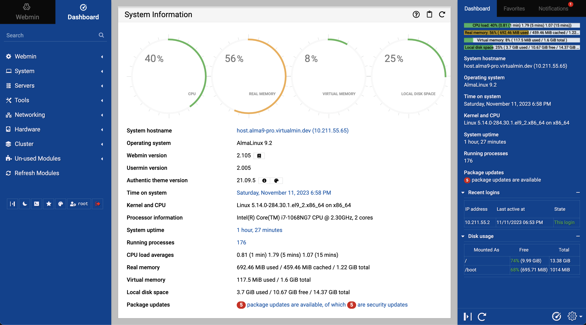
# ═════════════════════════════════
### *Cockpit — Cockpit is a web-based graphical interface for servers, intended for everyone.*
##### ***Cockpit is an intuitive, web-based interface designed to simplify the management of Linux servers. It provides users with real-time diagnostics, system monitoring, and administrative tools, enabling both beginners and experienced administrators to efficiently manage their systems. Cockpit supports tasks such as storage configuration, network setup, performance tracking, and more, all through a graphical interface accessible via a browser. Its modular design allows for extensibility, making it adaptable to diverse server environments.***
https://cockpit-project.org/<br><br>


# ═════════════════════════════════
### *NtopNG — High-Speed Web-based Traffic Analysis and Flow Collection*
####  *_NtopNG is a network traffic probe that provides 360° Network visibility, with its ability to gather traffic information from traffic mirrors, NetFlow exporters, SNMP devices, Firewall logs, Intrusion Detection systems._*
https://www.ntop.org/<br>
https://packages.ntop.org/apt/<br><br>
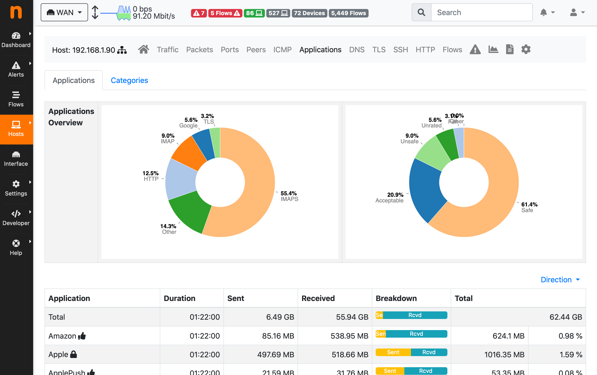<br><br>
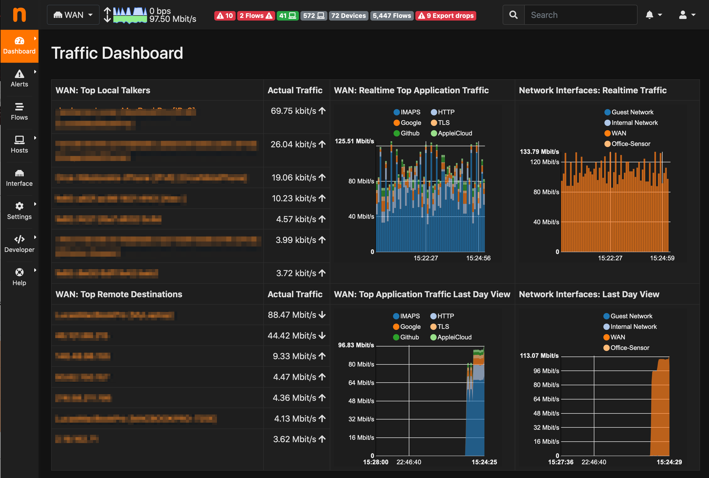
# ═════════════════════════════════
#### *Awesome-tunneling — List of ngrok/Cloudflare Tunnel alternatives and other tunneling software and services. Focus on self-hosting.*
https://github.com/anderspitman/awesome-tunneling

**-> https://github.com/tailscale**

**-> https://github.com/zerotier**
# ═════════════════════════════════
#### *RDP Wrapper Library*
https://github.com/sebaxakerhtc/rdpwrap<br><br>
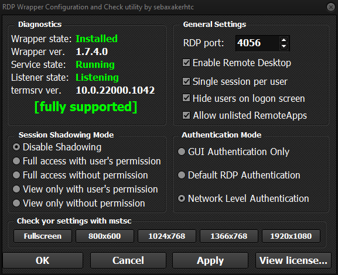
# ═════════════════════════════════
### *Chris Titus Tech's Windows Utility — This utility is a compilation of Windows tasks I perform on each Windows system I use. It is meant to streamline installs, debloat with tweaks, troubleshoot with config, and fix Windows updates. I am extremely picky about any contributions to keep this project clean and efficient.*
https://github.com/ChrisTitusTech/winutil<br><br>
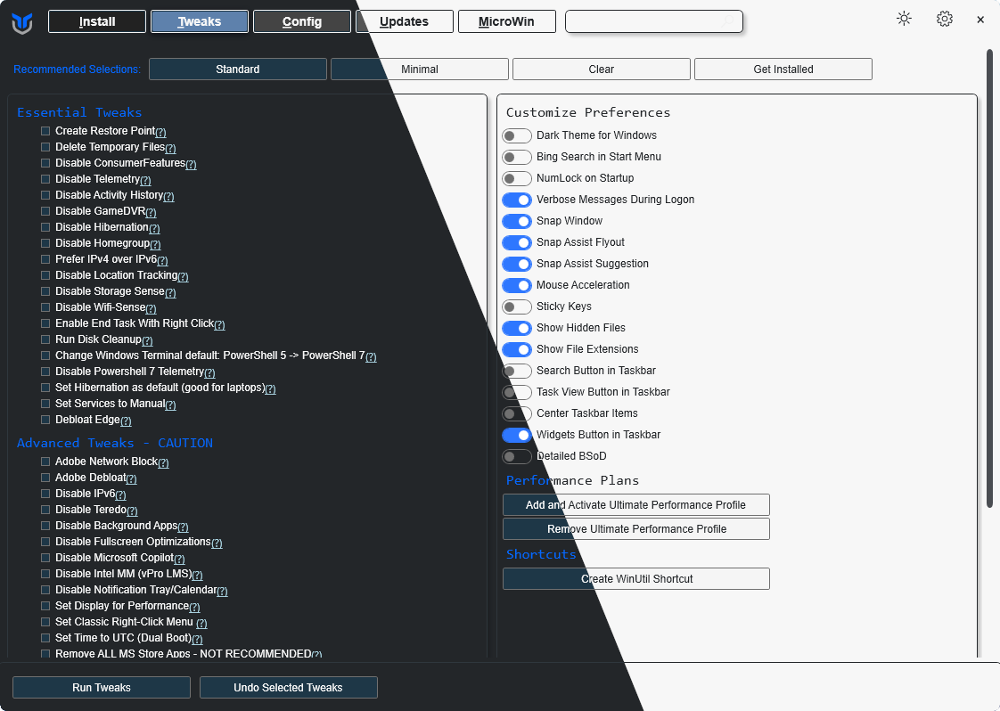
# ═════════════════════════════════
#### *HFS — HFS is a web file server to run on your computer. Share folders or even a single file thanks to the virtual file system.*
https://github.com/rejetto/hfs<br><br>
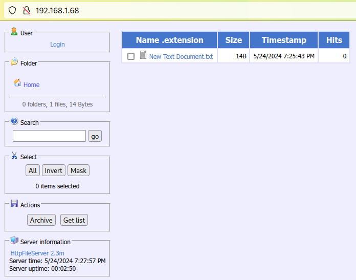
# ═════════════════════════════════
#### *Systeminformer — A free, powerful, multi-purpose tool that helps you monitor system resources, debug software and detect malware.*
https://github.com/winsiderss/systeminformer/ <br><br>
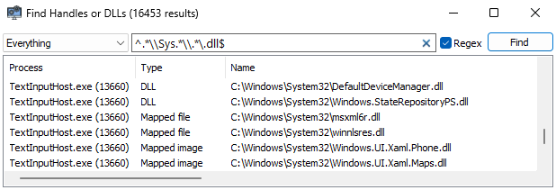
# ═════════════════════════════════
#### *Openmediavault — openmediavault is the next generation network attached storage (NAS) solution based on Debian Linux. Thanks to the modular design of the framework it can be enhanced via plugins. openmediavault is primarily designed to be used in home environments or small home offices.*
https://github.com/openmediavault/openmediavault<br><br>
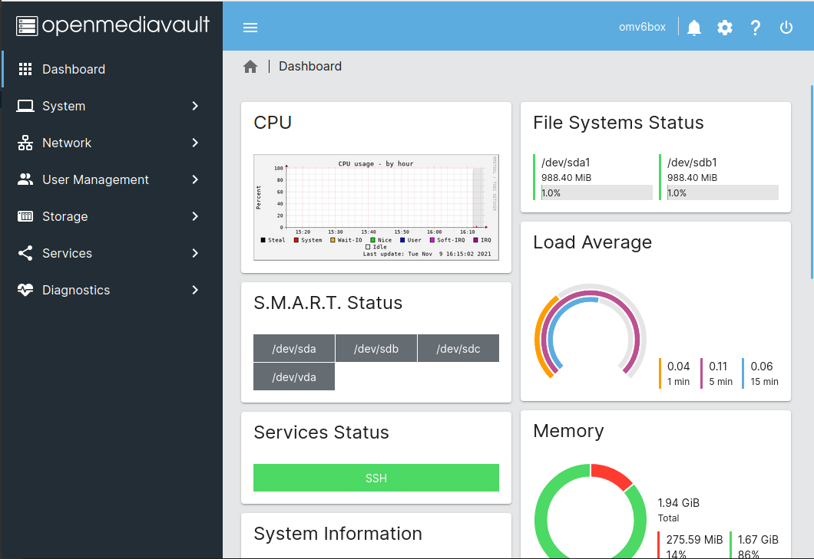
# ═════════════════════════════════
#### *Neofetch — A command-line system information tool written in bash 3.2+*
https://github.com/dylanaraps/neofetch<br><br>
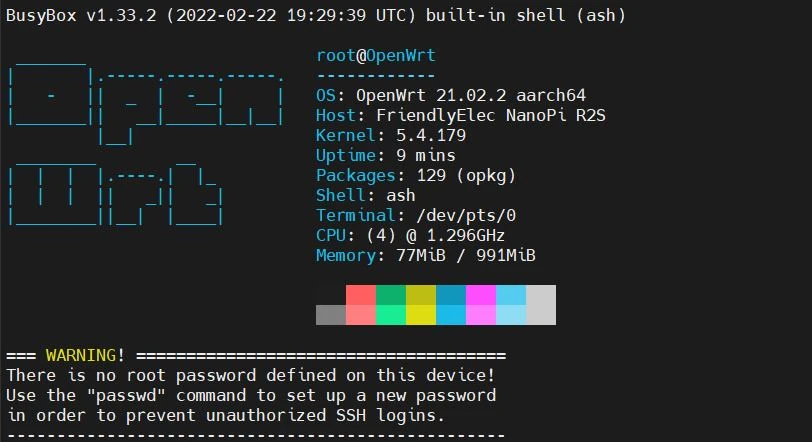
# ═════════════════════════════════
#### *Pfetch — A pretty system information tool written in POSIX sh.*
https://github.com/dylanaraps/pfetch<br><br>
# ═════════════════════════════════
### *tcptrack — Monitor TCP connections on the network*
https://explainshell.com/explain/1/tcptrack<br><br>
# ═════════════════════════════════
### *bpytop — Linux/OSX/FreeBSD resource monitor*
https://github.com/aristocratos/bpytop<br><br>
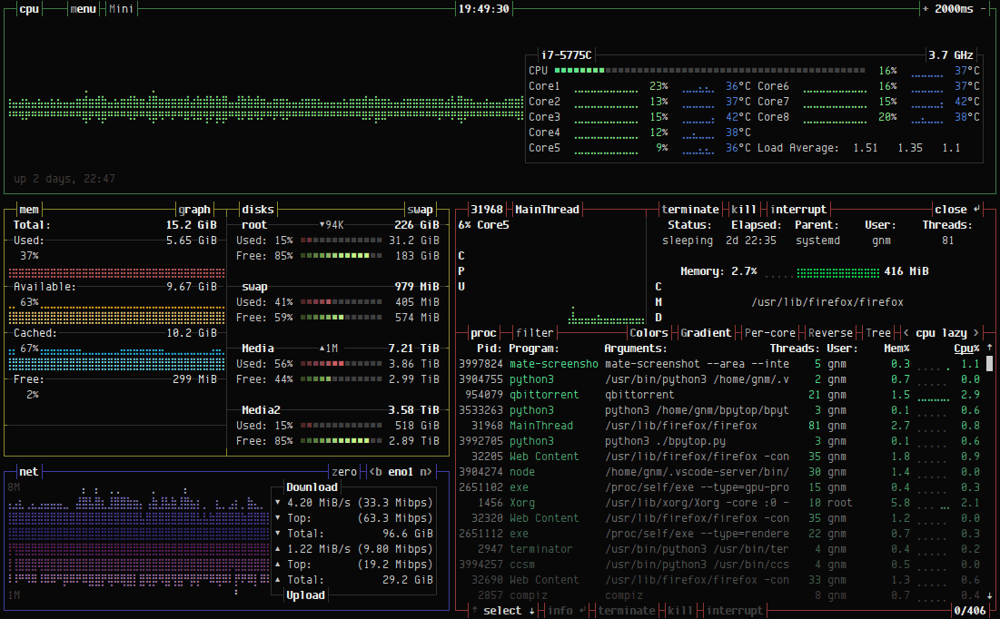
# ═════════════════════════════════
### *bleachbit — BleachBit system cleaner for Windows and Linux*
https://github.com/bleachbit/bleachbit<br><br>
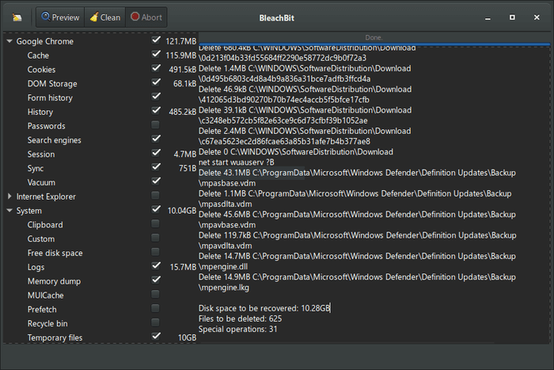
# ═════════════════════════════════
### *Stacer — Linux System Optimizer & Monitoring*
https://oguzhaninan.github.io/Stacer-Web/<br><br>
https://github.com/oguzhaninan/Stacer<br><br>
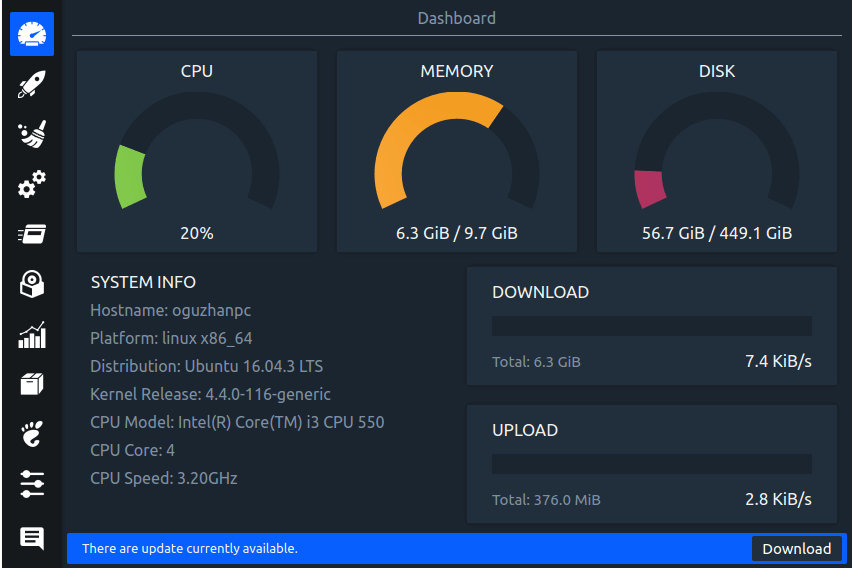
# ═════════════════════════════════
### *MobaXterm — Enhanced terminal for Windows with X11 server, tabbed SSH client, network tools and much more*
https://mobaxterm.mobatek.net/<br><br>
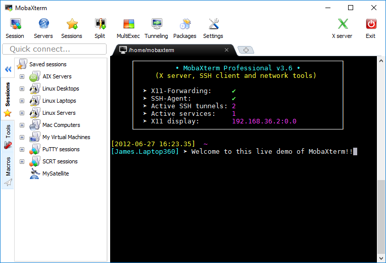
# ═════════════════════════════════
### *EtherApe — EtherApe is a graphical network monitor for Unix modeled after etherman. Featuring link layer, IP and TCP modes, it displays network activity graphically. Hosts and links change in size with traffic. Color coded protocols display.*
https://etherape.sourceforge.io/<br><br>
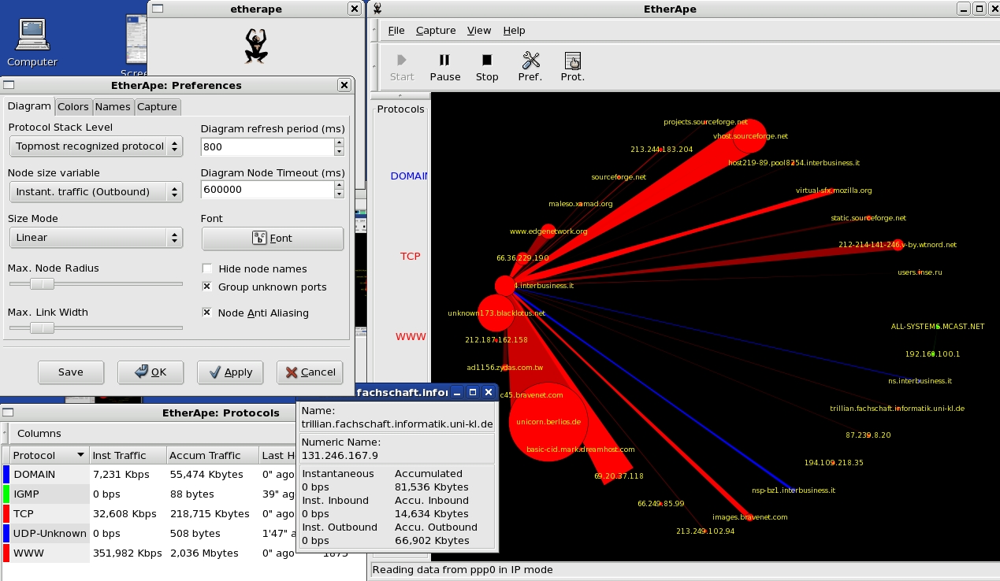
# ═════════════════════════════════
### *WinSCP — WinSCP is a popular free SFTP and FTP client for Windows, a powerful file manager that will improve your productivity. It supports also Amazon S3, FTPS, SCP and WebDAV protocols, as well as copying between two local directories. Power users can automate WinSCP using .NET assembly.*
https://github.com/winscp/winscp<br><br>
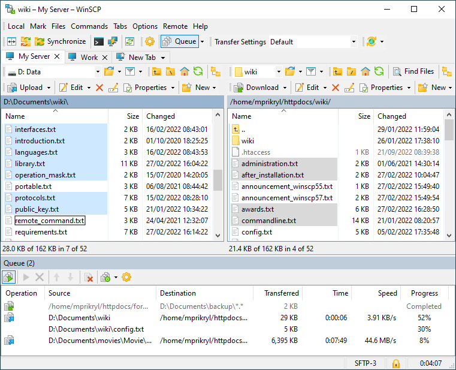
# ═════════════════════════════════
