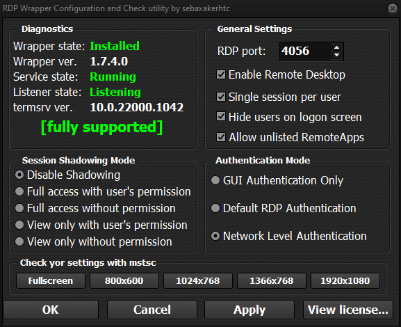
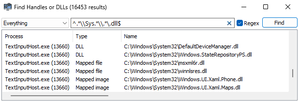
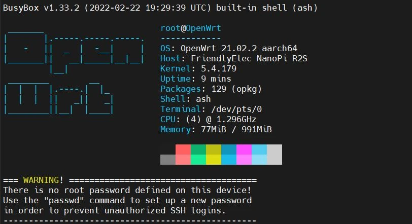
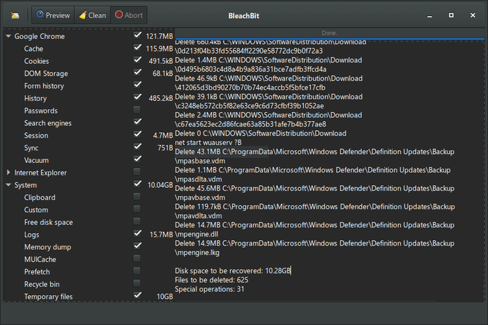

## V2RayN — Checks the release version, downloads it, configures it in English and runs it.
https://github.com/michele-tn/V2RayN-PowerShellC0nf19/blob/main/Download_V2RayN.ps1

## (MULTIPLE TCP TUNNELING) Connecting and Loading SSH private keys automatically on plink
https://gist.github.com/michele-tn/9afa8a91582b238bfdb009954c98b7b2

## Downloads the latest version of RUSTDESK (Nightly or Latest) using the GitHub API web service, configures application by setting the IP and keys of your self-hosted server.
https://gist.github.com/michele-tn/0d2cd5c0196a711dcfc127ada6af9559     

# ▂▃▅▇█▓▒░▒░▒░▒░▒░▒░▒

# '(◣_◢)' ●▬● **Favorite links** ●▬●▬●▬●
                               ▂▃▅▇█▓▒░۞░▒▓█▇▅▃▂

#### *Webmin — Powerful and flexible web-based server management control panel*
https://github.com/webmin/webmin  

# ═════════════════════════════════
#### *Awesome-tunneling — List of ngrok/Cloudflare Tunnel alternatives and other tunneling software and services. Focus on self-hosting.*
https://github.com/anderspitman/awesome-tunneling

**-> https://github.com/tailscale**

**-> https://github.com/zerotier**
# ═════════════════════════════════
#### *RDP Wrapper Library*
https://github.com/sebaxakerhtc/rdpwrap  

# ═════════════════════════════════
#### *HFS — HFS is a web file server to run on your computer. Share folders or even a single file thanks to the virtual file system.*
https://github.com/rejetto/hfs  

# ═════════════════════════════════
#### *Systeminformer — A free, powerful, multi-purpose tool that helps you monitor system resources, debug software and detect malware.*
https://github.com/winsiderss/systeminformer/   

# ═════════════════════════════════
#### *Openmediavault — openmediavault is the next generation network attached storage (NAS) solution based on Debian Linux. Thanks to the modular design of the framework it can be enhanced via plugins. openmediavault is primarily designed to be used in home environments or small home offices.*
https://github.com/openmediavault/openmediavault  

# ═════════════════════════════════
#### *Neofetch — A command-line system information tool written in bash 3.2+*
https://github.com/dylanaraps/neofetch  

# ═════════════════════════════════
#### *Pfetch — A pretty system information tool written in POSIX sh.*
https://github.com/dylanaraps/pfetch  
# ═════════════════════════════════
### *tcptrack — Monitor TCP connections on the network*
https://explainshell.com/explain/1/tcptrack  
# ═════════════════════════════════
### *bpytop — Linux/OSX/FreeBSD resource monitor*
https://github.com/aristocratos/bpytop  
# ═════════════════════════════════
### *bleachbit — BleachBit system cleaner for Windows and Linux*
https://github.com/bleachbit/bleachbit  

# ═════════════════════════════════

