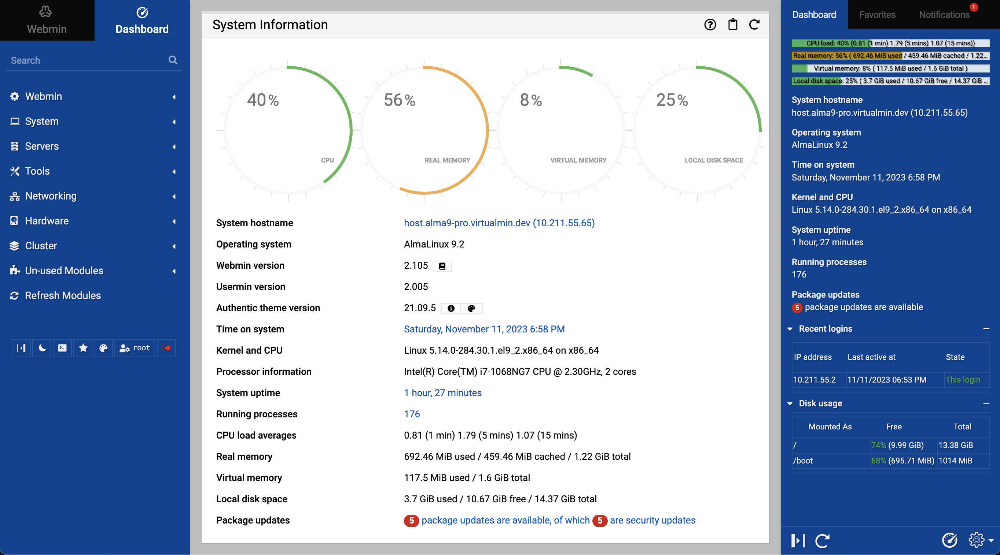
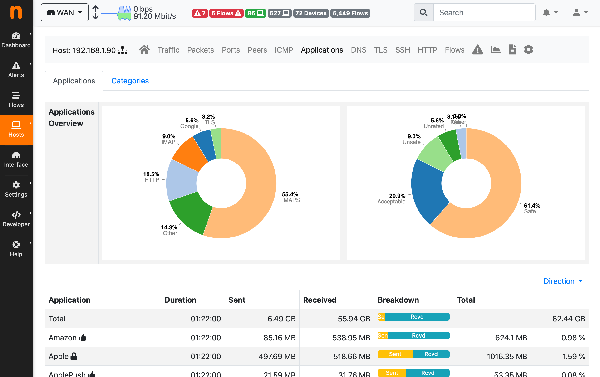
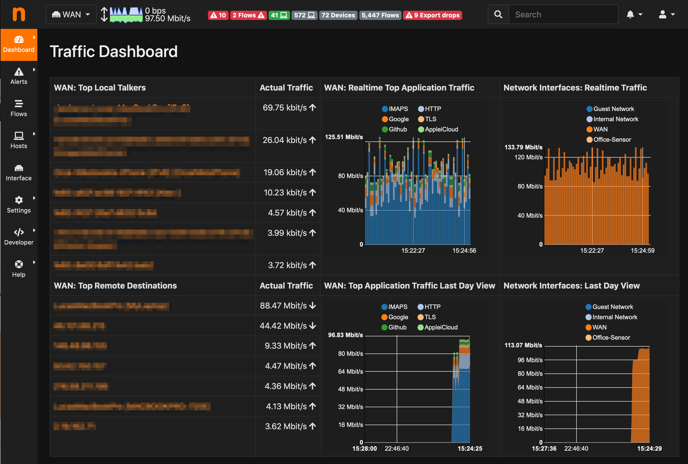
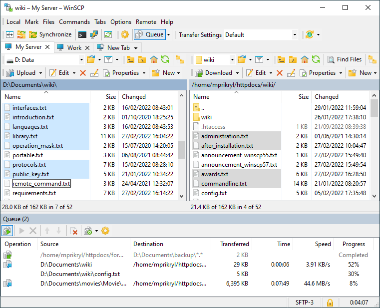

  
**[C#] Downloads the latest version of RUSTDESK (Nightly or Latest) using the GitHub API web service, configures application by setting the IP and keys of your self-hosted server.** 
🔗 [gist.github link](https://gist.github.com/michele-tn/b8e9d018da0170c7f90db36adf56585e)  
**[POWERSHELL] Downloads the latest version of RUSTDESK (Nightly or Latest) using the GitHub API web service, configures application by setting the IP and keys of your self-hosted server.** 
🔗 [gist.github link](https://gist.github.com/michele-tn/0d2cd5c0196a711dcfc127ada6af9559)  
**V2RayN — Checks the release version, downloads it, configures it in English and runs it.** 
🔗 [github.com/michele-tn/V2RayN-PowerShellC0nf19 link](https://github.com/michele-tn/V2RayN-PowerShellC0nf19/blob/main/Download_V2RayN.ps1)  
**(MULTIPLE TCP TUNNELING) Connecting and Loading SSH private keys automatically on plink** 
🔗 [gist.github link](https://gist.github.com/michele-tn/9afa8a91582b238bfdb009954c98b7b2)  

                               ▂▃▅▇█▓▒░۞░▒▓█▇▅▃▂
# '(◣_◢)' ●▬● **Favorite links** ●▬●▬●▬●

#### *Webmin — Powerful and flexible web-based server management control panel*
https://github.com/webmin/webmin  

# ═════════════════════════════════
### *NtopNG — High-Speed Web-based Traffic Analysis and Flow Collection*
####  *_NtopNG is a network traffic probe that provides 360° Network visibility, with its ability to gather traffic information from traffic mirrors, NetFlow exporters, SNMP devices, Firewall logs, Intrusion Detection systems._*
https://www.ntop.org/ 
https://packages.ntop.org/apt/  
  

# ═════════════════════════════════
#### *Awesome-tunneling — List of ngrok/Cloudflare Tunnel alternatives and other tunneling software and services. Focus on self-hosting.*
https://github.com/anderspitman/awesome-tunneling

**-> https://github.com/tailscale**

**-> https://github.com/zerotier**
# ═════════════════════════════════
#### *RDP Wrapper Library*
https://github.com/sebaxakerhtc/rdpwrap  

# ═════════════════════════════════
### *Chris Titus Tech's Windows Utility — This utility is a compilation of Windows tasks I perform on each Windows system I use. It is meant to streamline installs, debloat with tweaks, troubleshoot with config, and fix Windows updates. I am extremely picky about any contributions to keep this project clean and efficient.*
https://github.com/ChrisTitusTech/winutil  

# ═════════════════════════════════
#### *HFS — HFS is a web file server to run on your computer. Share folders or even a single file thanks to the virtual file system.*
https://github.com/rejetto/hfs  

# ═════════════════════════════════
#### *Systeminformer — A free, powerful, multi-purpose tool that helps you monitor system resources, debug software and detect malware.*
https://github.com/winsiderss/systeminformer/   

# ═════════════════════════════════
#### *Openmediavault — openmediavault is the next generation network attached storage (NAS) solution based on Debian Linux. Thanks to the modular design of the framework it can be enhanced via plugins. openmediavault is primarily designed to be used in home environments or small home offices.*
https://github.com/openmediavault/openmediavault  

# ═════════════════════════════════
#### *Neofetch — A command-line system information tool written in bash 3.2+*
https://github.com/dylanaraps/neofetch  

# ═════════════════════════════════
#### *Pfetch — A pretty system information tool written in POSIX sh.*
https://github.com/dylanaraps/pfetch  
# ═════════════════════════════════
### *tcptrack — Monitor TCP connections on the network*
https://explainshell.com/explain/1/tcptrack  
# ═════════════════════════════════
### *bpytop — Linux/OSX/FreeBSD resource monitor*
https://github.com/aristocratos/bpytop  

# ═════════════════════════════════
### *bleachbit — BleachBit system cleaner for Windows and Linux*
https://github.com/bleachbit/bleachbit  

# ═════════════════════════════════
### *Stacer — Linux System Optimizer & Monitoring*
https://oguzhaninan.github.io/Stacer-Web/  
https://github.com/oguzhaninan/Stacer  

# ═════════════════════════════════
### *MobaXterm — Enhanced terminal for Windows with X11 server, tabbed SSH client, network tools and much more*
https://mobaxterm.mobatek.net/  

# ═════════════════════════════════
### *EtherApe — EtherApe is a graphical network monitor for Unix modeled after etherman. Featuring link layer, IP and TCP modes, it displays network activity graphically. Hosts and links change in size with traffic. Color coded protocols display.*
https://etherape.sourceforge.io/  

# ═════════════════════════════════
### *WinSCP — WinSCP is a popular free SFTP and FTP client for Windows, a powerful file manager that will improve your productivity. It supports also Amazon S3, FTPS, SCP and WebDAV protocols, as well as copying between two local directories. Power users can automate WinSCP using .NET assembly.*
https://github.com/winscp/winscp  

# ═════════════════════════════════
